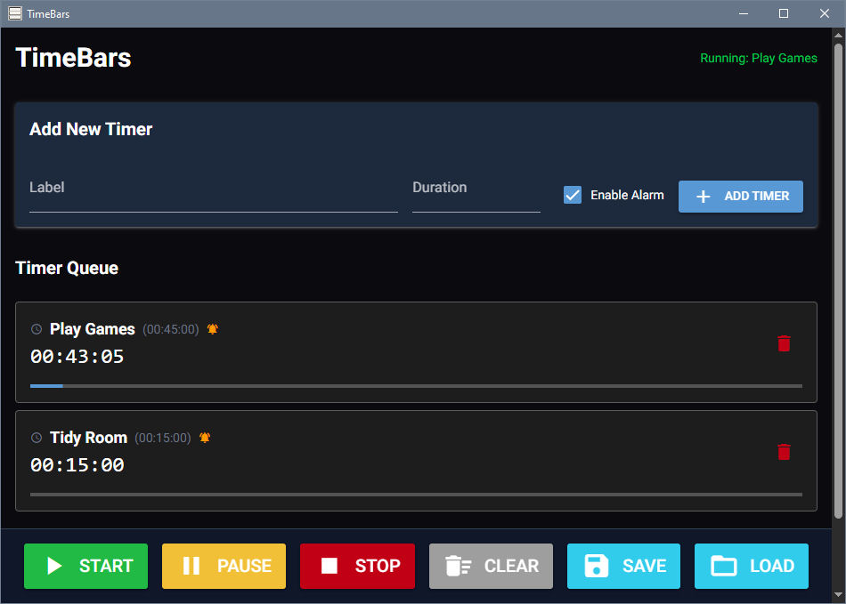

# TimeBars
Status: Release - Working.

### Description
TimeBars is a versatile timer application featuring a modern GUI interface that allows users to create and manage a sequential queue of custom timers. It's designed for users who need to manage complex time intervals effectively—whether for work sprints, break periods, cooking stages, or gaming sessions. Each timer can be individually labeled, customized with precise durations, and set to trigger an audible and visual alarm upon completion. Optimally one would have this on a second screen while playing "Fallout 4" or whatever is your thing.

### Features
- **Custom Timer Queue:** Create multiple named timers with custom durations that run sequentially in a managed queue.
- **Flexible Duration Input:** Enter time as HH:MM or HHMM format (e.g., "1:30" or "90" for 90 minutes) with no preset limitations.
- **Persistent Timer State:** Your timer queue is automatically saved and restored between sessions.
- **Real-time Visual Progress:** Live progress bars and countdown displays (HH:MM:SS) for each timer in the queue.
- **Per-Timer Alarm Control:** Enable or disable the alarm individually for each timer as needed.
- **Audible and Visual Notification:** Plays a custom 3-bleep alarm sound and flashes the timer card red when complete.
- **Interactive Controls:** Start, Pause, Stop, and Clear All functions with status indicators.
- **Interface Zoom:** Hold Ctrl and scroll to resize the interface (50% - 200%) for accessibility.
- **Modern Web-Based UI:** Clean, dark-themed interface using native system webview (Edge on Windows).
- **Automatic Dependency Management:** Installer handles virtual environment and all requirements automatically.

### Preview
- 
# 
- There is a nice batch menu to, install or launch...
```
=============================================================================
                  _____ _                ____
                 |_   _<_>________   ___| __ >  ____ _______
                   | | | |  _   _ \ / _ \  _ \ / _  |  _/ __|
                   | | | | | | | | |  __/ |_> | <_| | | \__ \
                   |_| |_|_| |_| |_|\___|____/ \____|_| |___/

=============================================================================


    1. Run Program

    2. Run Installer


=============================================================================
Selection; Menu Options = 1-2, Exit Program = X:

```
- The installer isnt too shabby...
```
=============================================================================
    TimeBars: Running Installer
=============================================================================

Detected Python version: 3.12.4

Install location: C:\Program_Files\TimeBars\TimeBars
Python version: 3.12.4
Virtual environment already exists, skipping creation.
Upgrading pip...
Pip upgraded.
Installing dependencies...
  nicegui>=1.4.0
  pywebview>=5.0
  pythonnet
Dependencies installed.
Creating directories...
Data directory ready.
Scripts directory ready.
Creating data files...
Replacing existing persistent.json with fresh default.
persistent.json created.
alarm-bleep.wav already exists, skipping generation.

Installation Complete!

Installation complete

Press any key to continue . . .
```

### System Requirements 
- Windows 10/11 - For full functionality of the built-in browser.
- Python 3.10+ - A modern version of python, testing with v3.12.4, on system PATH.
- 50MB disk space - AI.
- Sound Output - for bleeps.

### Installation
1. Right click > Run as Admin on `TimeBars.bat`, to go to the Batch Menu.
2. Select the Installer option to set up the virtual environment and dependencies.
3. Ensure 
2. The installer will create `data/alarm-bleep.wav` and `data/persistent.json` automatically.

### Usage 
Usage Guide for TimeBars:
1. Run `TimeBars.bat` to launch the application.
2. Enter a **Label** for your timer (e.g., "Coffee Break").
3. Enter **Duration** in HH:MM or HHMM format (e.g., "0:15", "15", "1:30", "90").
4. Check/uncheck **Enable Alarm** as desired.
5. Click **Add Timer** to append it to the queue.
6. Repeat steps 2-5 to build your timer sequence.
7. Click **Start** to begin the countdown queue.
8. Use **Pause** to temporarily halt, **Stop** to reset, or **Clear All** to empty the queue.
9. Completed timers automatically disappear after their 5-second alarm phase.

### File Structure
```
TimeBars/
├── TimeBars.bat          # Batch run/install launcher menu.
├── installer.py          # First-time setup (venv, deps, data files)
├── program.py            # Main entry point
├── scripts/
│   ├── init.py
│   ├── interface.py      # GUI implementation (NiceGUI)
│   ├── timers.py         # Timer engine and state management
│   ├── config.py         # Persistence and settings
│   └── utility.py        # Audio playback
├── data/
│   ├── persistent.json   # Saved timer queue and settings
│   └── alarm-bleep.wav   # Generated alarm sound
└── venv/                 # Virtual environment (created by installer)
```

### Notation
- Its made/tested on 10, but supposedly if you have 7-8.1 it will fallback to system browser.
- The application runs in a native window but uses web technologies—no browser required.
- Timer data auto-saves when the application closes through [x] on top right, and loads timers on start..

### Disclaimer
This software is subject to the terms in License.Txt, covering usage, distribution, and modifications. For full details on your rights and obligations, refer to License.Txt.
